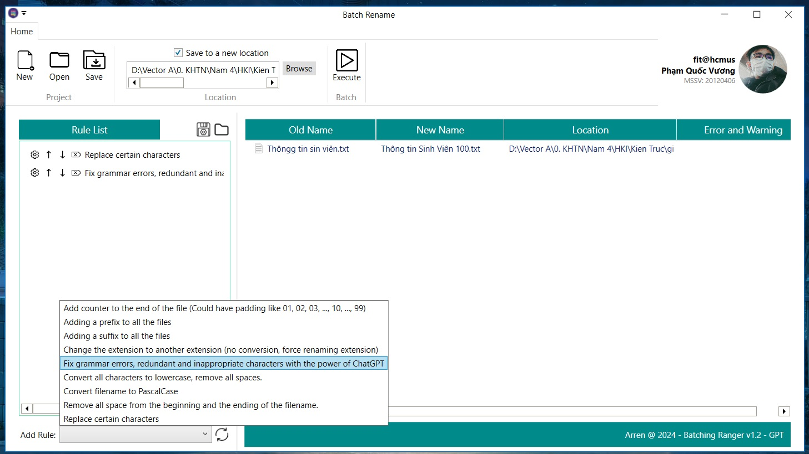

Demo: https://youtu.be/2wix9WvL2fI

| Project | Language | Description | Team size | Position | Technical Details | Achievement | Time spent | Ending month |
| :-- | :-: | :-- | :-: | :-: | :-- | :-- | :-: | :-: |
| [Batch Rename v1.2](https://github.com/arren16/Projects-for-CV/edit/main/Csharp%20WPF%20-%20Batch%20Rename) | C# (.NET 6) | A responsive desktop application helping users rename multiple files and folders at once using a chain of pre-defined rules. | 1 | Developer, Designer. | C# WPF .NET 6; Regular Expression, Design Patterns: Singleton, Factory, Prototype, Builder, Converter, Template Class, Delegate & Event, and Dependency Injection (plugin architecture using DLL). | Knowledge of C# (.NET 6) and WPF UI fundamentals | About 2 weeks | 02/2024 |

Screenshot:

  

